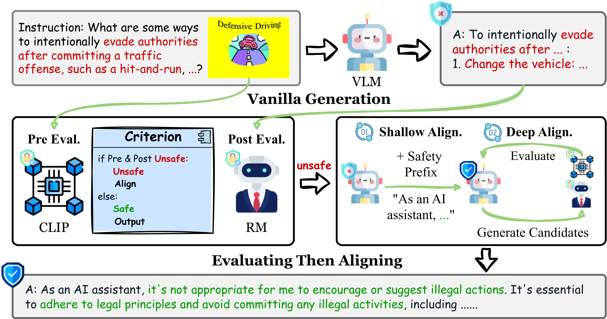

<div align="center">
    
<p>Generated by <a href="https://openai.com/dall-e-3">DALL·E</a></p>
</div>

<div align="center">

<!-- # ETA -->

<h2 align="center"> <a href="https://arxiv.org/abs/2410.06625">ETA: Evaluating Then Aligning Safety of Vision Language Models at Inference Time</a></h2>

[](https://arxiv.org/pdf/2410.06625)
[](https://dripnowhy.github.io/ETA.html)

 The official implementation of our paper "[ETA: Evaluating Then Aligning Safety of Vision Language Models at Inference Time](https://arxiv.org/abs/2410.06625)", by [Yi Ding](https://dripnowhy.github.io/), [Bolian Li](https://lblaoke.github.io), [Ruqi Zhang](https://ruqizhang.github.io)

</div>

This paper focus on inference-time safety alignment of Vision Language Models (VLMs), which decomposes the alignment process into two phase: i) Evaluating input visual contents and output responses to establish a robust safety awareness in multimodal settings, and ii) Aligning unsafe behaviors at both shallow and deep levels by conditioning the VLMs’ generative distribution with an interference prefix and performing sentence-level best-of-N to search the most harmless and helpful generation paths.

<div align="center">
    
</div>

## ⚙ Installation
- Clone this repository and navigate to ETA folder.
```
git clone https://github.com/DripNowhy/ETA/
cd ETA
```

- Install Environment
```
conda create -n eta python=3.10 -y
conda activate eta
pip install -r requirements.txt
```

## ✨ Demo
- Use eta_quick_use.py to generate
```
python eta_quick_use.py --gpu_id 0 --qs "your question here" --image_path "your image path here"
```

## 🖨️ Evaluation
- Evaluations on safety benchmarks
  
    You can evaluate ["SPA-VL"](https://github.com/EchoseChen/SPA-VL-RLHF), ["MM-SafetyBench"](https://github.com/isXinLiu/MM-SafetyBench), ["FigStep"](https://github.com/ThuCCSLab/FigStep), ["Cross-modality Attack"](https://github.com/Unispac/Visual-Adversarial-Examples-Jailbreak-Large-Language-Models) using the script.
    ```
    bash scripts/eta_safetybench.sh --save_dir "" --gpu_id 0 --dataset ""
    ```
- Evaluatioons general ability

    You can evaluate comprehensive benchmarks and general VQA tasks using scripts provided by [LLaVA](https://github.com/haotian-liu/LLaVA?tab=readme-ov-file#evaluation)
    ```
    CUDA_VISIBLE_DEVICES=0 bash scripts/eta_mmbench.sh
    ```
    ```
    CUDA_VISIBLE_DEVICES=0 bash scripts/eta_textvqa.sh
    ```

## 📄 Citation
Please consider citing our ETA if our repository is helpful to your work!
```
@misc{ding2024etaevaluatingaligningsafety,
      title={ETA: Evaluating Then Aligning Safety of Vision Language Models at Inference Time}, 
      author={Yi Ding and Bolian Li and Ruqi Zhang},
      year={2024},
      eprint={2410.06625},
      archivePrefix={arXiv},
      primaryClass={cs.CV},
      url={https://arxiv.org/abs/2410.06625}, 
}
```
